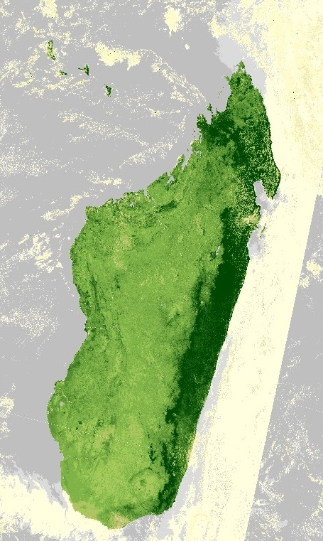

# Example product

<!-- Example Copernicus Browser link. Replace the URL inside the parentheses with the actual link when available. -->

[Copernicus Browser link](https://link.dataspace.copernicus.eu/uncz)

## Scripts

| Script                                | Short description                            |
| ------------------------------------- | -------------------------------------------- |
| [Visualised](./scripts/visualised.js) | RGB visualisation of NDVI in shades of green |
| [Raw](./scripts/raw.js)               | Returns raw NDVI values                      |

## General description of the script

The well known and widely used NDVI is a simple, but effective index for quantifying green vegetation. It normalizes green leaf scattering in Near Infra-red wavelengths with chlorophyll absorption in red wavelengths.

The value range of the NDVI is -1 to 1. Negative values of NDVI (values approaching -1) correspond to water. Values close to zero (-0.1 to 0.1) generally correspond to barren areas of rock, sand, or snow. Low, positive values represent shrub and grassland (approximately 0.2 to 0.4), while high values indicate temperate and tropical rainforests (values approaching 1). It is a good proxy for live green vegetation; see [1] for details.

The normalized difference vegetation index, abbreviated NDVI, is calculated using near infrared and red wavelengths.

NDVI = (NIR - RED) / (NIR + RED)

For Sentinel-3 OLCI, the NDVI is calculated using NIR band 17 and Red band 8:

NDVI = (B17 - B08) / (B17 + B08)

## Description of representative images

NDVI of France, acquired on 29 September 2024.

## References

- Wikipedia, Normalized Difference Vegetation Index . Accessed on October 4th 2017.
