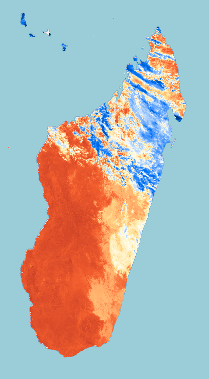

# Example product

<!-- Example Copernicus Browser link. Replace the URL inside the parentheses with the actual link when available. -->

[Copernicus Browser link](https://link.dataspace.copernicus.eu/uncz)

## Scripts

| Script                                | Short description                                  |
| ------------------------------------- | -------------------------------------------------- |
| [Visualised](./scripts/visualised.js) | Blue-red visualisation of Land Surface Temperature |

## General description of the script

Land Surface Temperature (LST) is the radiative skin temperature of the land surface, as measured from a satellite. It is a key variable in the study of climate change, urban heat islands, and land-atmosphere interactions.

The LST product from Sentinel-3 SLSTR L2 is derived from the thermal infrared channels S8 (10.854 μm) and S9 (12.022 μm) using a split-window algorithm. The output represents temperature in Kelvin.

The script visualises LST using a blue-to-red colour ramp spanning temperatures from 223 K (−50 °C, very cold surfaces such as polar ice) to 323 K (+50 °C, very hot and arid land surfaces):

- Deep blue — extremely cold surfaces (below 223 K)
- Light blue / white — near-freezing surfaces (~273 K)
- Yellow / orange — warm surfaces (~293–303 K)
- Dark red — very hot surfaces (above 323 K)

## Description of representative images

## References

- ESA, Sentinel-3 SLSTR Land Surface Temperature. Available at: https://sentiwiki.copernicus.eu/web/s3-slstr-l2-lst-product
